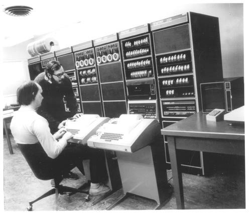
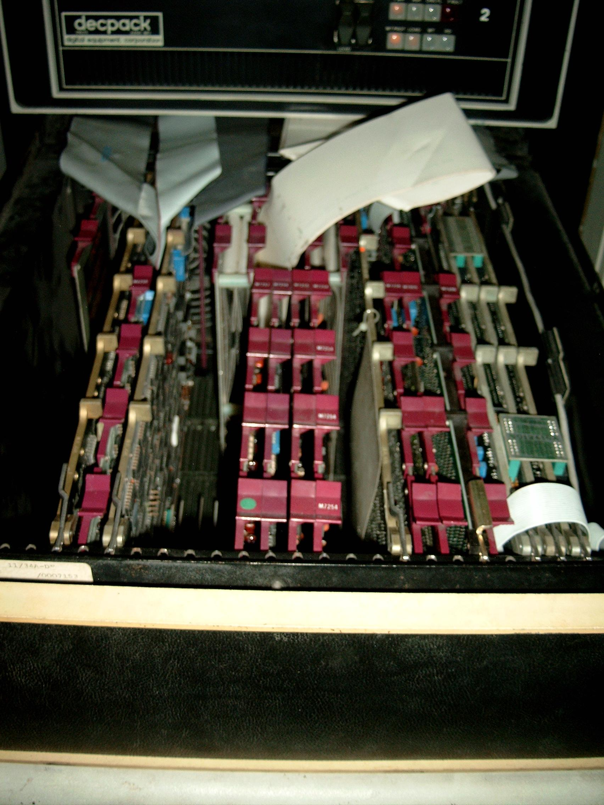
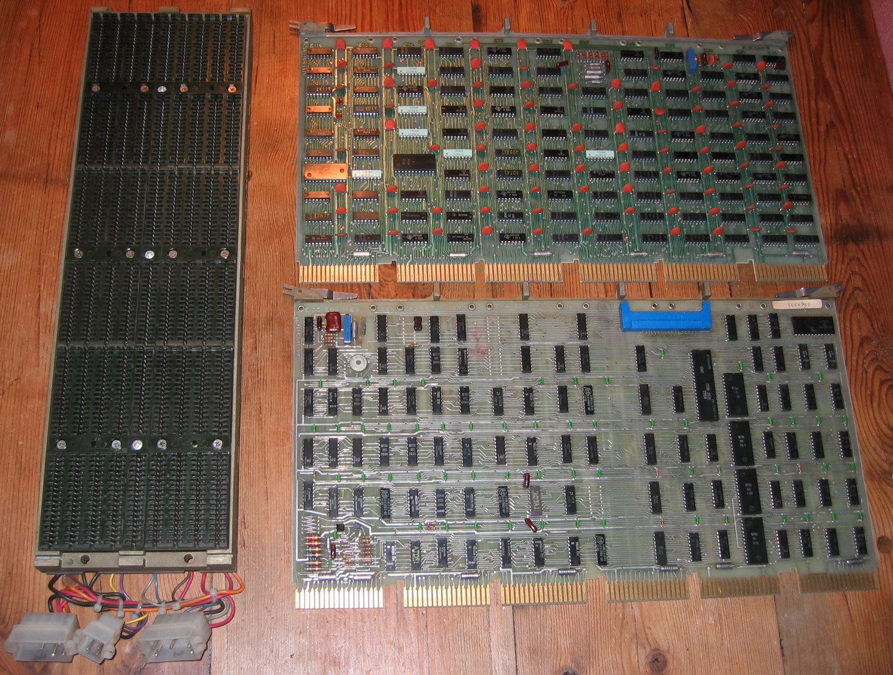
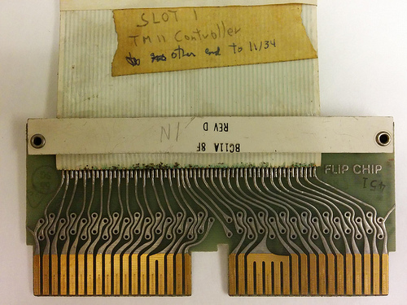
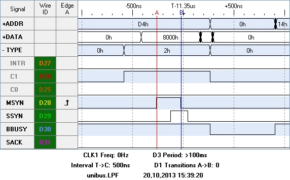

QUniLator is specialised to a family of machines that stopped being sold in 1995.
This page is the background the rest of the manual assumes.

## The PDP-11

DEC's PDP-11s are 16-bit minicomputers, built from 1969 to 1995. More than twenty
models, all software-compatible. Processor speeds ran from a few hundred kilohertz
to 20 MHz, memory from 8 KB to 4 MB, and every kind of peripheral was attached to
them — dozens of different tape and disk drives among them. Wikipedia lists 35
operating systems.

The architecture is genuinely beautiful, and it influenced a great deal of what
came after.

Some PDP-11s are still doing serious work, mostly controlling special equipment.
Far more are kept alive by enthusiasts, and they make good hobbyist machines: they
are robust, mostly made of standard parts, and all the documentation and software
is online — schematics, user manuals, diagnostics and operating systems alike.

## How a machine is packaged

DEC packaged a 1970s PDP-11 in strict hierarchy.

At the top, a large machine is a row of 19-inch **racks**.

A rack holds a stack of **boxes**, which pull out on drawers. A box contains a
power supply and one or more **backplanes** — arrays of contact slots wire-wrapped
together.

The backplane is populated with **cards**. Slots and connectors all follow DEC's
Flip-Chip standard.

> **UNIBUS · UniBone**
>
> A single UNIBUS connects every controller across the boxes, daisy-chained on
> white flat cable. To reach every box in a rack, a UNIBUS could span several
> metres — which is why its electrical design is so careful, and why the choice of
> bus driver matters.
>
> 

All those layers of packaging were expensive. Data General undercut DEC partly by
using larger boards, which needed fewer boxes and fewer power supplies.

## UNIBUS

The bus is much of why the PDP-11 line succeeded. UNIBUS — the *universal system
bus* — connects everything uniformly. Main memory, mass-storage controllers,
communications adapters, the system clock, the memory management unit and the
processor's own registers are all mapped into one address space, so the same
instructions reach memory and I/O alike.

There are no I/O instructions in a PDP-11. There is no need for any.

### Signals and the handshake

UNIBUS is 56 signal wires, most of them carrying 18 address bits and 16 data
bits. The protocol is **asynchronous**, with a handshake between bus master and
bus slave, so fast and slow devices share one bus without the fast ones being held
back — and so propagation delay down a long cable is not a problem.

A typical transaction completes in about a microsecond. On a scope, a DATO — the
master writing into a slave — looks like this:

1. The master asserts **MSYN** (cursor A), telling the slaves that an address and
   data for a new cycle are valid.
2. Every slave latches the address; the selected one latches the data and acts on
   it — a memory card writes the word into its RAM. When it is done it asserts
   **SSYN**.
3. The master takes the slave's data, releases the bus and drops MSYN (cursor B).
4. The slave sees the cycle accepted, releases the bus and drops SSYN.

That handshake is what the PRU implements, in software, on both cards.

## QBUS

Around 1975 DEC introduced a variant with fewer wires, better suited to very small
PDP-11s: **QBUS**. The essential difference is that address and data are
**multiplexed** onto shared DAL lines rather than each having their own, which is
what makes the wire count so much lower.

The second difference is address width. UNIBUS is fixed at 18 bits — 256 KB. The
larger UNIBUS processors (11/44, 11/70) reach 22 bits only over a separate memory
bus. QBUS was designed from the start for 16, 18 or 22 bits, with the processor
deciding which, and the upper 8 KB I/O page selected by a dedicated **BS7** line
rather than by address decoding.

That flexibility mostly hides inside the processor, but it does not hide from a
card that has to be both master and slave — which is why a QBone must be told the
width rather than inferring it. See
[Fitting it to a backplane](../hardware/fitting-the-card.md).

## Grant chains

Both buses acknowledge interrupt and DMA requests by routing the processor's
acknowledgement — the **grant** — not to every requesting card in parallel, but to
the *first* card on the bus. A card that did not make the request must forward the
signal to the next, and so on down the line. That is the **grant chain**, and
unoccupied slots must forward it with continuity cards.

> **UNIBUS · UniBone**
>
> The interrupt chain (`BG4`–`BG7`) is closed with G727 cards in row D; the DMA
> chain (`NPG`) is closed on the backplane by connecting wire-wrap pin CA1 to CB1.
>
> A machine that never uses interrupts or DMA can run with an open chain — except
> that the common M9302 active terminator raises SACK on an open chain, which
> allocates the bus and stops the machine. That makes it a quick indicator of a
> grant-chain fault.

> **QBUS · QBone**
>
> Grants daisy-chain from slot to slot, and empty slots between the processor and
> the last used slot need G9047 continuity cards. On the card itself the C/D
> continuity is jumpered, and the right setting depends on the backplane.

This matters more than it sounds. **The card closes the grant chain in software**,
by watching the incoming pins and forwarding the signals — so while QUniLator is
not running, the chain through its slot is open. It is a common reason for a
machine that will not start with the card fitted; see the
[FAQ](../project/faq.md#my-machine-will-not-start-with-the-card-fitted).
