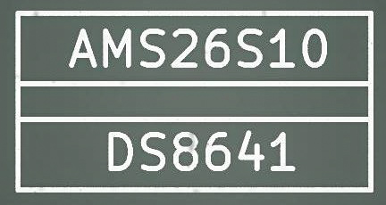
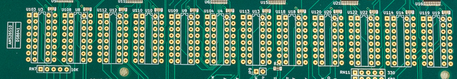
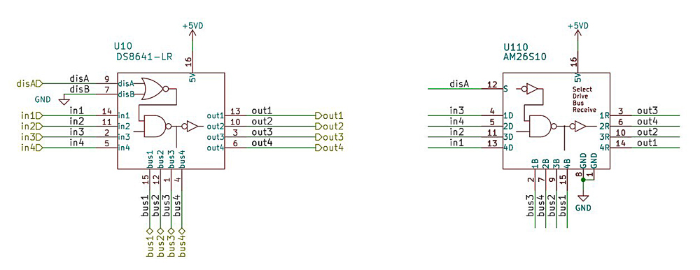
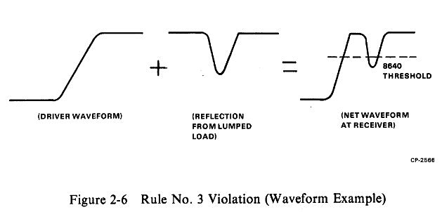
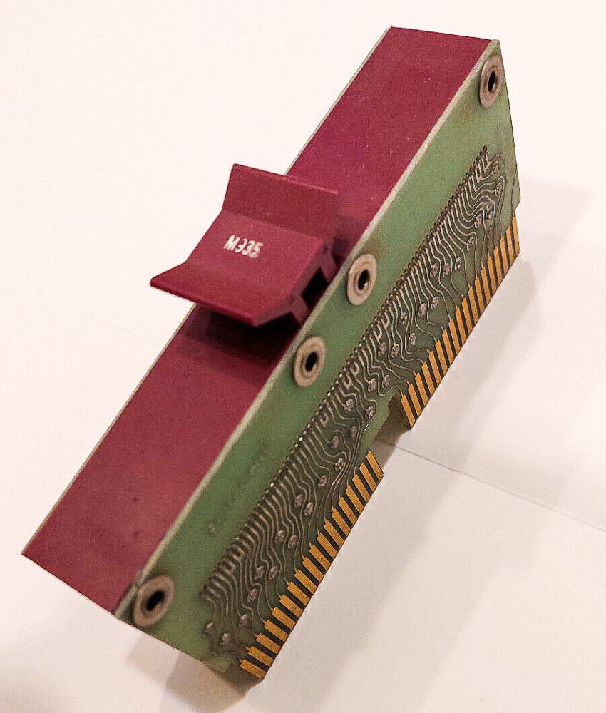
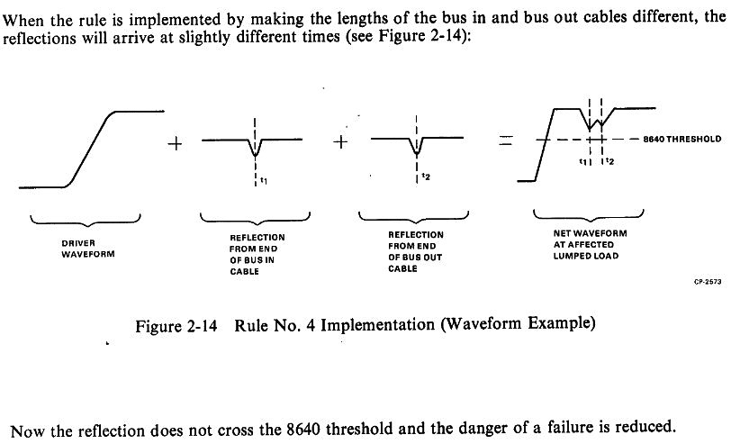

UNIBUS and QBUS lines are terminated with resistor pairs of roughly 200/400 Ω — a
low impedance that ordinary TTL can neither drive nor receive at the right
thresholds. Driving the bus alone costs several watts, and burnt-out bus drivers
are a common reason for a dead PDP-11.

DEC's answer was a special line driver/receiver, the **DS8641**, and that is what
the cards use.

## The supply problem

DS8641s and their compatibles — DL8641, the Russian КР559ИП3 — get harder to find
every year. So the 2023-04 card revision carries **parallel sockets** for the
DS8641 and for the AM26S10, which has a different pinout but is designed for the
same job and also contains four transmitter/receiver pairs.

The **75138** is pin-compatible with the AM26S10. Neither is fully *electrically*
compatible with the DS8641:

| | Switching time |
|---|---|
| DS8641 | 30 ns |
| 75138 | 20 ns |
| AM26S10 | 10 ns |

The usual "faster is better" does not hold here. Besides differing receiver
thresholds, faster switching produces more ringing. On specification the 75138 is
the closer match; on availability the AM26S10 wins — it is still in production
and stocked in DIP and SMD.

The chips can be mixed freely on the board. You will not want to.

## Why this is not purely digital

Bus signals switch in a few hundred nanoseconds, and a sharp edge carries
frequencies at or above 100 MHz. At that point transmission-line behaviour
applies: a pulse reflects off a cable end whose termination does not match the
driver's impedance, and the reflection shows up as **ringing** — one clean pulse
transmitted, several received.

That is not cosmetic. Address lines on the QBUS BDAL are latched by BSYNC; a
bouncing BSYNC latches bus noise over the valid address that was latched a moment
earlier.

DEC knew. The [UNIBUS Troubleshooting
manual](http://www.bitsavers.org/pdf/dec/unibus/UnibusTroubleshooting.pdf) tells
field engineers to measure ringing and suppress it with backplane jumper cables
of different lengths — which is what is hidden inside an M9202, and why there are
several M9202 variants carrying different amounts of cable.

This is also why the receiver's input threshold matters: these signals are not
"all digital". The exact properties of the driver *matter*.

## Where an alternative is safe

The two buses share electrical specifications but not typical installations.

> **UNIBUS · UniBone**
>
> A UNIBUS PDP-11 routinely spans multiple backplanes, boxes and racks. Even
> hobbyist setups do — a TU10 or TU56 puts the controller in the drive rack, so a
> white BC11 UNIBUS cable runs between racks. Ringing and impedance matter over
> those distances and connectors, which is why UNIBUS is asynchronous with such
> elaborate electrical and timing rules.

> **QBUS · QBone**
>
> A QBUS system is compact. The specification allows the same cabling, but a
> PDP-11/03, /23, /73 or MicroVAX with even two backplanes is a rare sight, let
> alone one spanning racks. Signal traces are short, impedance mismatches matter
> much less, and DEC shipped small QBUS systems without a bus-end terminator at all.

**Bottom line:** alternative bus drivers work on small UNIBUS systems and
comfortably on QBUS ones — testing bears that out. For a UNIBUS system with BC11
cables, stay with DS8641.
