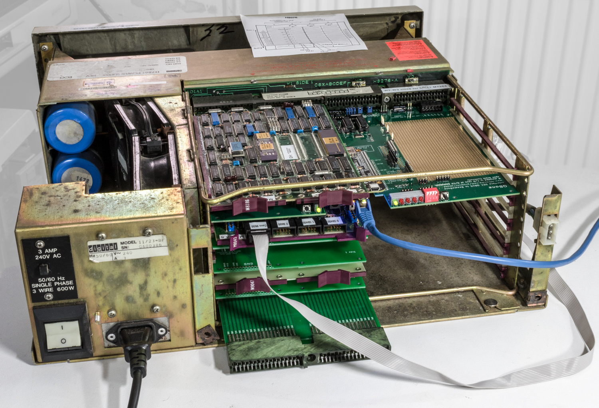
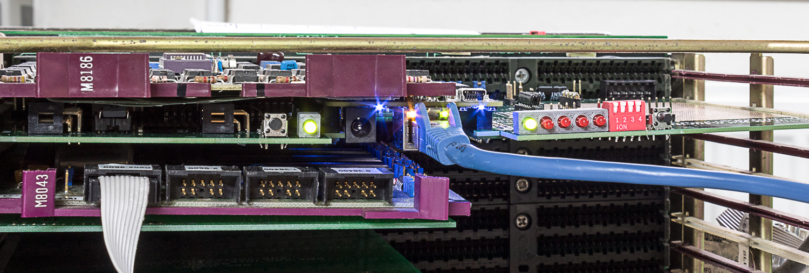
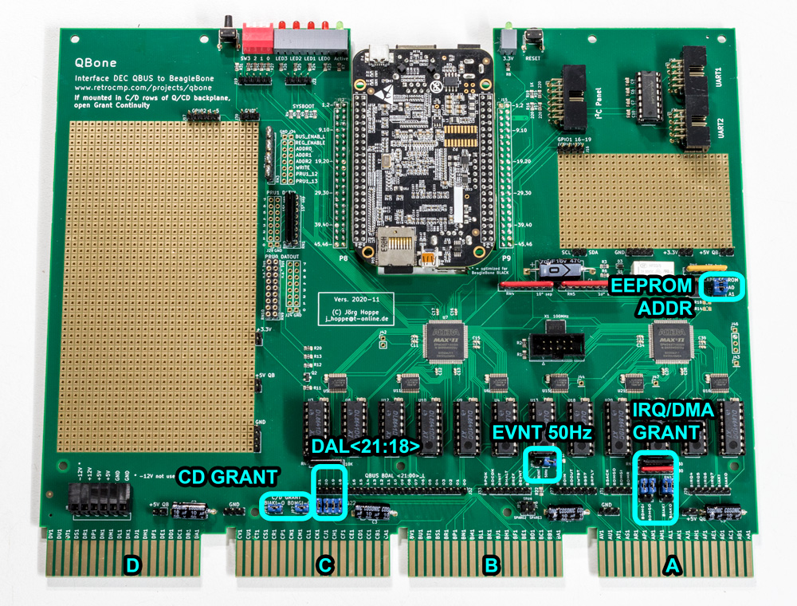
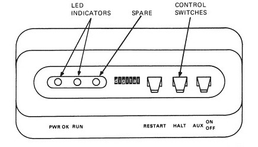

## Which slot

> **UNIBUS · UniBone**
>
> A standard quad **SPC** slot, with the **NPG grant chain open at CA1–CB1**. If
> you are emulating an RL11, the tidiest thing is to pull the existing RL11 and put
> UniBone in its place.

> **QBUS · QBone**
>
> Any quad QBUS slot. Close every empty QBUS slot between the processor and the
> last used slot with **G9047** grant continuity cards — and note that not all
> slots are QBUS slots and the slot order is not always obvious. See *Backplane
> geometry* below.

> [!WARNING]
> **Watch for shorts**
>
> The BeagleBone is a little fat, and some of its parts can touch the solder side
> of a module sitting above it. Either slip thin card between the modules, or
> mount the card below an empty slot filled with a grant continuity card.

## Terminators

Single-backplane systems do not need a terminator pack at the bus end — DEC
processors terminate the bus themselves. Multi-backplane systems involve some
alchemy about where to add terminators and whether to use 120 Ω or 240 Ω at the
far end; some backplanes have resistor packs soldered on already.

The card carries **no onboard terminators**. If it is replacing the processor —
for a self test, say — you need terminator packs.

## Jumpers

> **QBUS · QBone**
>
> ### Address width
>
> QBUS runs 16, 18 or 22 bits, and the processor decides which. QBone cannot infer
> it from bus traffic, so two things must be set:
>
> - On an **LSI-11/03**, remove the `DAL<21:18>` jumpers — those backplane lines
>   carry CPU-internal signals there.
> - Tell the software the width, so it knows how much memory to emulate and for
>   which addresses to assert the `BS7` I/O-page signal.
>
> Which processor implies which width: the LSI-11 M7264 and 11/2 are 16-bit; the
> 11/23 with an F-11 is 18-bit; the 11/23+ and the J11-based 11/53, /73 and /93 are
> 22-bit.
>
> ### C/D grant continuity
>
> Interrupt and DMA grant signals daisy-chain from slot to slot. Fit the **CD
> GRANT** jumpers if the card's C/D fingers land in a socket carrying a standard
> QBUS:
>
> | Backplane | Card position | CD GRANT jumpers |
> |---|---|---|
> | H9270 | any slot | closed |
> | H9275 | any slot | closed |
> | H9276 | any slot | open |
> | H9278 | slots 1–3 | open |
> | H9278 | slots 4–8 | closed |
>
> Get this wrong and controllers plugged behind the card will fail on interrupts or
> DMA.
>
> ### 50 Hz on EVNT
>
> DEC power supplies put a 50/60 Hz square wave on the EVNT line. On another power
> option, close the **EVNT 50Hz** jumper to have the card generate it.
>
> ### Test and factory jumpers
>
> The **IRQ/DMA GRANT** block can disconnect IAKI/IAKO/DMGI/DMGO from the card or
> short them for self test. **EEPROM ADDR** selects the cape EEPROM address. Leave
> both in their factory positions.

## Backplane geometry

> **QBUS · QBone**
>
> All QBUS backplanes carry the bus on rows **A and B**. What varies is C and D:
> sometimes more QBUS, sometimes a separate bus, sometimes a separate bus with
> daisy-chain logic.
>
> There is one rule to remember: **if the card's C/D fingers go into a QBUS slot
> rather than a special C/D slot, set the grant continuity jumpers JP7 and JP8.**
>
> Backplanes also differ in slot ordering — the "zig-zag" — and in how many special
> C/D slots they have. The [QBUS information
> page](http://web.frainresearch.org:8080/projects/pdp-11/) is the reference worth
> having open.
>
> ### Which lines the backplane must carry
>
> The backplane has to carry the address lines in use between processor and memory
> or I/O device. As far as is known every backplane is at least 18-bit capable, so
> `DAL<17:0>` is always wired. The H9270 can be modified to carry `DAL<21:18>` as
> well, which lets a 4 MB machine run in that handsome 4×4 cage; several web pages
> describe how.
>
> Then, per device class:
>
> - **Passive device** (memory or register): must respond only to the address lines
>   in use, and ignore the unused upper ones.
> - **Active DMA device**: must generate a proper `BS7` for I/O-page addresses.
>
> Some cards have their own width jumper — an RLV12 does. Others are limited: a
> DRV11-B M7950 has only 16 address lines.

## The line-time clock

> **QBUS · QBone**
>
> QBUS `EVNT` causes an unconditional processor trap, and is normally used for the
> line-time clock. It can be produced by the power supply, by a peripheral like a
> BDV11 M8012 (which switches it under program control), or by the card's own 50 Hz
> source via jumper JP9.
>
> **Only one source may drive it.**
>
> Whether the processor *uses* it is a separate tangle. Some cabinets tie EVNT to
> ground through an AUX ON/OFF front-panel switch (BA-23S, 11/23) — on others that
> switch is main power. Some processors disable the trap by wire-wrap jumper
> (LSI-11, 11/23); some by software register (11/23+, J11); on a KDJ11-E the
> *presence* of that register is itself configurable, and it combines with a
> hardware jumper.
>
> 
>
> Whether you need it depends on the guest:
>
> - **Unixes need it** and will not boot without it.
> - **RSX-11M and M+ need it** for task scheduling.
> - **RT-11** wants it only for the time of day.
> - If EVNT is enabled and the processor takes the trap, the system needs a handler
>   at vector 100 or it will crash.

> **UNIBUS · UniBone**
>
> UNIBUS has no EVNT line. The line-time clock is a KW11-L, which QUniLator can
> emulate.

## Then

With the card seated and jumpered, go to
[Installing the software](../start/install.md), or to the
[acceptance test](../start/acceptance-test.md) if the card is new to you.
