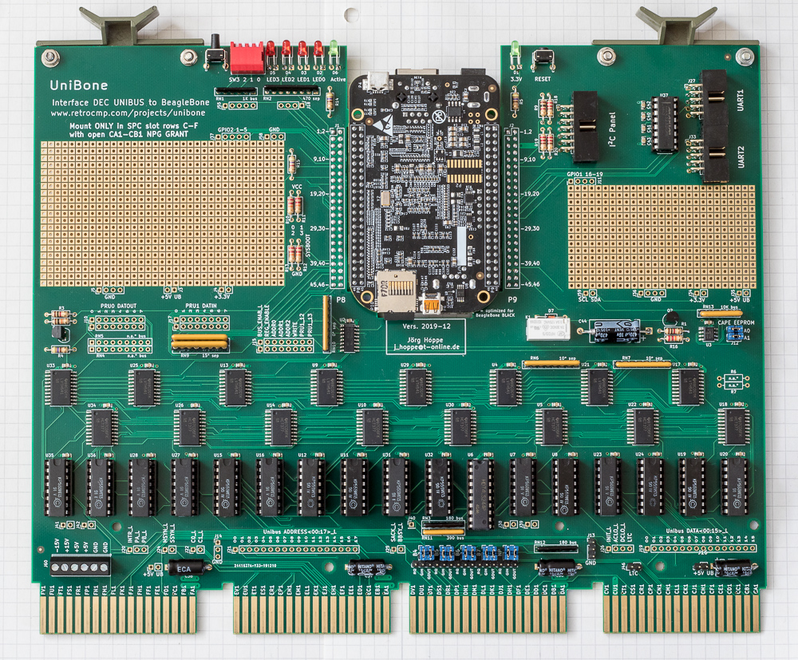
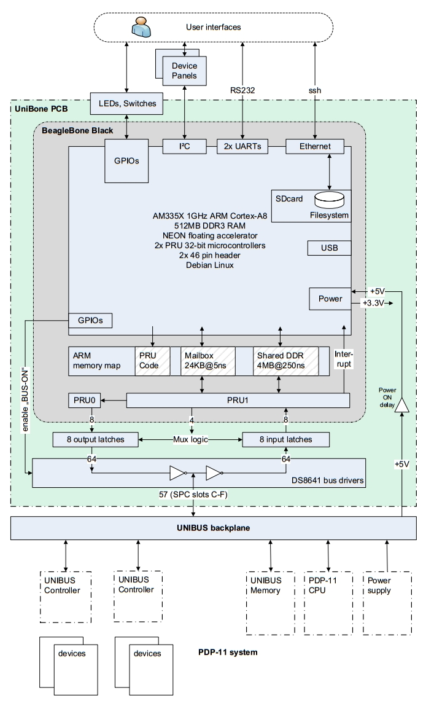
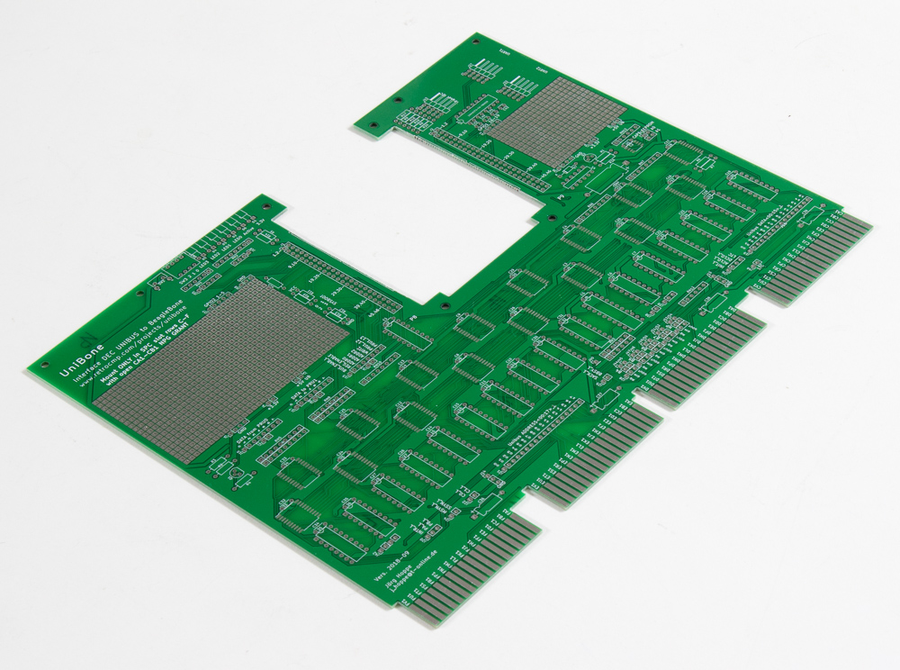
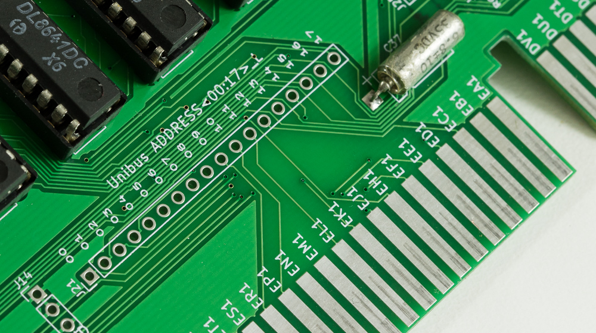

The card looks retro, and that is not coincidence. It deliberately mimics a
1980s quad card: through-hole parts wherever possible, silver tantalums at the
slot fingers — sometimes taken off old boards — and that green. Standard TTL, no
FPGAs. No white or blue LEDs. BERG-style connectors, big transistors and
resistors. Later revisions carry more SMD and a different BeagleBone mount.

## What is on it

**Bus interface.** Every bus signal line is connected bidirectionally through
DS8641 drivers, so the card can be a **slave** (answering as a memory location or
device register) and a **master** (arbitrating, interrupting, doing DMA). Even
ACLO and DCLO can be driven, which is how the card commands the processor through
a power-cycle reset. A global *driver enable* effectively unplugs the whole card
from the bus. On driver substitutes, see [Bus drivers](bus-drivers.md).

> **UNIBUS · UniBone**
>
> UNIBUS has 56 standard signal lines, and all of them are wired. That takes 16
> DS8641s.

**The PRU datapath.** PRU0 and PRU1 each have 32 dedicated high-speed GPIOs, but
only some reach the BeagleBone's pin headers — 8 outputs on PRU0, and 4 outputs
and 8 inputs on PRU1. These 8-bit, 100+ MHz ports are widened to 64-bit, 10+ MHz
ports by an array of register latches.

PRU GPIOs are best driven in one direction only: flipping a pin from input to
output costs on the order of a microsecond, against 5 ns for normal operation. So
there are two separate unidirectional datapaths — one in, one out — meeting at
the bidirectional bus drivers. The whole bus protocol lives on **PRU1**; PRU0
only forwards data to its GPIO outputs.

**Level conversion.** Old 5 V logic accepts 3.3 V drive, losing some noise
margin. The other direction needs care: 5 V-tolerant 74LVTH-family latches
protect the BeagleBone's inputs.

**Power.** +5 V comes from the slot; the BeagleBone makes its own 3.3 V. Because a
vintage DEC supply can behave arbitrarily on power-on and the DCLO "power good"
signal is under application control, a **relay delays +5 V by about a second** to
give the BeagleBone a clean ramp. The slot's other rails are routed to a power
connector, so the card can feed a standalone backplane.

**ARM↔PRU communication** runs over shared memory. The small PRU-local RAM is
mapped into the ARM address space as a command and data mailbox; the large ARM
DDR is reachable by the PRUs more slowly, across several cache and bus layers,
and is what backs emulated memory. When PRU1 decodes a register access to an
emulated device, it signals the ARM software with an interrupt.

**Everything else.** LEDs and switches on ordinary GPIOs. Two patch fields with
GND, 3.3 V and 5 V for your own circuitry. Labelled pin headers on every
high-speed PRU signal and every bus signal. A powered I²C bus for
lamps-and-switches panels. Two UARTs on DSUB-9 connectors, for a Linux session on
a real VT100 or for emulated serial controllers. Ethernet is the intended way in
— Wi-Fi would not work inside an all-metal DEC case.

## Mechanics

A BeagleBone is only slightly taller than a DEC board slot, and neighbouring
boards usually have space above their ICs because DEC logic ICs are not socketed.
That is the gap this design exploits.

The bone is not mounted on top of the PCB but hangs **upside-down in a cutout**,
held at the right vertical alignment by length-reduced pin headers and small
piggyback PCBs. Fiddly and time-consuming to build — and it is why the card fits
a standard Flip-Chip slot at all.

With a 90° angled Ethernet plug the card fits even in a closed DEC BA11 case, and
the SD card slot and USB port stay accessible.

## Useful without any parts on it

An unpopulated PCB still earns its slot.

It works as a long grant continuity card with an added NPG-closing function — the
card is also a G727. And the labelled slot fingers, bus pin headers and patch
fields make it a bus prototyping board; fit the DS8641s and you have a driver
stage as well.

Wrap yourself a bus adapter for your logic analyser off those headers, and your
bench will look marginally less like a B-movie laboratory.

## Design files

Schematics are KiCad, and the whole project is published — see
[Getting a card](../start/get-a-card.md#build-your-own).
