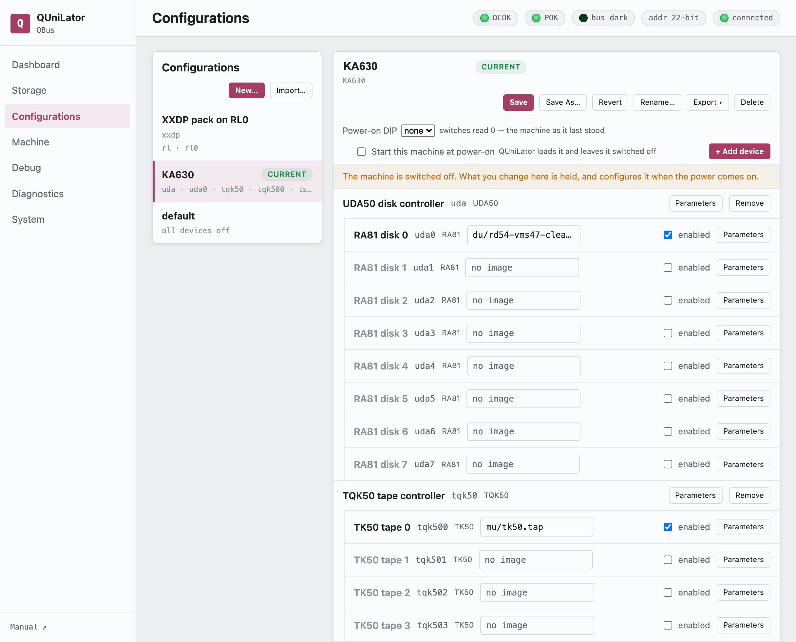

A **configuration** is the set of devices a machine carries and the parameters
they carry them with — the whole machine as one document. The list on the left is
every machine this QUniLator knows; the panel on the right is the one you picked.

**CURRENT** marks the configuration that is loaded. **MODIFIED** means the live
machine has drifted from what was saved — **Save** writes the drift back,
**Revert** throws it away.

## The device set

Devices are grouped under the controller they hang off: an RLV12 with its four
RL02s, a UDA50 with its drives. Each row has an **enabled** box, the image it
holds if it takes one, and **Parameters** for everything else — bus address,
interrupt vector, backplane slot, emulation speed.

**+ Add device** brings in a card the machine does not yet have; **Remove** takes
one out.

Enabling is what puts a card *into the machine*, and the order matters: set a
drive's image first, then enable it. Enabling a controller rebuilds the drives
under it, which clears an image assigned beforehand.

> [!NOTE]
> **Applying is not switching on**
>
> Applying a configuration loads it; it does not put it on the bus. The machine
> still comes up dark, and [AUX ON/OFF](dashboard.md#control-panel) is what
> brings it up.

## Power-on DIP

Binds this configuration to a DIP switch setting, **1–15**. The service reads the
switches **once, at startup**, and loads the configuration that claims that
value. At most one configuration may claim a setting.

Setting **0** is not a slot: it brings back *the machine that was last running*,
unsaved changes and all, from a mirror the board keeps of the live setup.

Because the switches are read only at startup, changing machines means changing
the switches **and restarting the service** — a power cycle keeps whatever is
loaded.

## Starting by itself

**Start this machine at power-on** makes the configuration switch itself on
rather than waiting for the panel switch. It cannot be made safe — the board
still cannot see the backplane — so it is made loud: the boot logs a warning
naming the cards it put on the bus, and raises a standing notice that holds until
somebody acknowledges it.

## Moving a machine

**Export** offers three forms:

| | |
|---|---|
| **Configuration document** | the JSON, and what an import reads |
| **Menu command script** | the same device set as `sd`/`p`/`en` commands for the [interactive menu](../start/from-qunibone.md) |
| **Archive with the media** | the document *with every image its drives name*, as one `.qcfg.zip` |

The archive is how a whole working machine travels to somebody else. **Import…**
reads one back, or a bare configuration document.

An import is validated before anything is written: a device this QUniLator does
not have, or a parameter it does not know, is refused by name. The **DIP binding
travels but does not displace** — a value another configuration here already
claims is dropped, and the answer says so.

## The rest

**Save As…** copies under a new name, **Rename…** renames, **Delete** removes.
**New…** starts from nothing.
