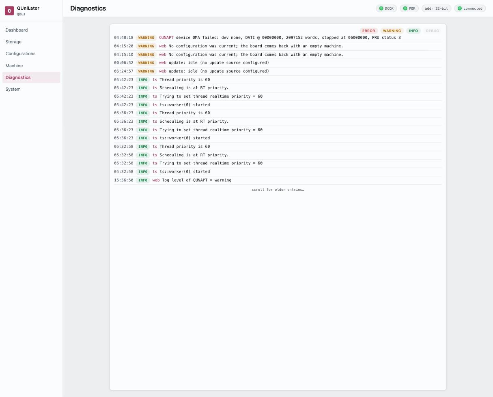

The live log, newest first. Every line carries the time, its severity, the source
that emitted it, and the message.

Sources are the parts of the emulator that log: `web` for the service, `QUNAPT`
and `PRU` for the bus and firmware layers, and each device under its own name —
`rl`, `uda`, `ts`, `delqa`.

## The severity chips

**ERROR**, **WARNING**, **INFO** and **DEBUG** across the top filter what is
shown. They are a **view filter only** — they hide and reveal lines that have
already arrived, and change nothing about what the emulator emits.

The choice is kept in the page's address (`?levels=…`), so a filtered view
reproduces from its URL and survives a reload.

## The stream is live, not a journal

The board keeps no server-side log history: lines are pushed as they happen, over
the same event connection everything else uses. What you see is what has arrived
since the page connected — *scroll for older entries…* reaches back only as far
as that.

So the log is a thing to be watching while you do something, rather than a record
to consult afterwards. For the record, the board's own `journalctl` carries the
service's output.

## Raising a source's level

**This screen does not set log levels.** Every source sits at **warning** by
default, so `info` and `debug` lines from a device you are chasing are never
emitted — filtering for DEBUG here will show nothing, because nothing was sent.

Changing a source's level is an API operation (`/api/logging`), and the
[MCP server](../tools/mcp-server.md) exposes it as `set_log_level`. The pattern
is: raise the one source you care about, watch, then put it back — a source left
at `debug` costs the running machine real time.

> [!NOTE]
> **A control for this is not in the interface yet**
>
> The endpoint and the per-source levels exist and persist across restarts; what
> is missing is a screen for them.
