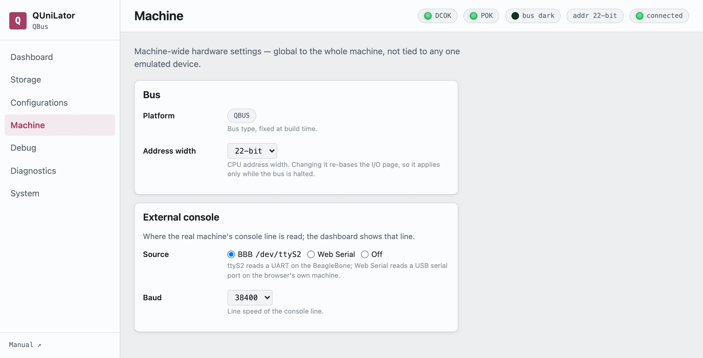

The handful of settings that belong to the whole machine rather than to any one
device, and are therefore not part of a configuration.

## Bus

**Platform** is QBUS or UNIBUS, fixed when the software was built. It is what the
card is, not a choice.

**Address width** is the CPU's — 16, 18 or 22 bits on QBUS, 18 on UNIBUS.
Changing it re-bases the I/O page, so it **applies only while the bus is
halted**. Asked for on a running machine the setting is left alone and the
interface says why.

## External console

Where the real machine's console line is read from. Which you want follows from
the processor in the box, and getting it wrong is the most common reason a
console appears dead.

| **Source** | |
|---|---|
| **BBB `/dev/ttyS2`** | a UART on the BeagleBone backs the console. This is for a processor with a **serial line of its own** — an 11/53, an 11/73 — whose console connector is cabled to the cape. |
| **Web Serial** | a USB serial port on the machine running the *browser* backs it instead. A **Connect** button appears; Web Serial needs a one-time grant to reach the port. |
| **Off** | nothing does — and the port is then free for QUniLator's own emulated `DL11` to be the console. This is for a processor with **no console of its own**, and for an emulated processor, which has its own. |

**Baud** must match what the processor's own line is jumpered for.

> [!TIP]
> **Garbage means the baud is wrong; silence means the cable is**
>
> A mismatched speed still delivers characters — `ôôôôWWô` and the like. A line
> that produces nothing at all, in any CPU state, is not connected.
>
> Rather than waiting for the machine to speak first, assert **HALT** and press
> Return: a halted processor sits in micro-ODT and answers. That works at any
> moment, with no boot and no guest.

> [!CAUTION]
> **One thing at a time on that port**
>
> With the source set to `ttyS2`, the bridge holds the port. Enabling an emulated
> `DL11` that also names `ttyS2` does not take it — the device quietly stays off,
> and only the log says so. On a processor that has its own console, leave `DL11`
> disabled: a second SLU at 777560 would be two cards answering one address.
