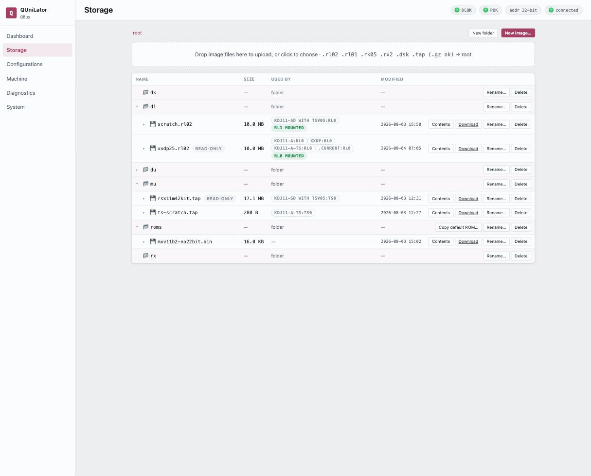

The library of disk and tape images, in `/var/lib/qunilator/images`. Drag a file
onto the page to upload it — `.rl02`, `.rl01`, `.rk05`, `.rx2`, `.dsk` and
`.tap`, gzipped or not — or use **New image…** to make an empty one and **New
folder** to organise them.

The folders are conventions, one per device family: `dl` for RL packs, `dk` for
RK, `du` for MSCP volumes, `mu` for tapes, `rx` for floppies, and `roms` for
bootstrap images, where **Copy default ROM…** drops in the ones QUniLator ships.

## Reading the table

**Used by** is the column that keeps you out of trouble. It names every saved
configuration that references this image and the drive it puts it in, and marks
the ones a running machine currently has **MOUNTED** — so before deleting or
renaming anything you can see whether a machine depends on it.

**read-only** marks an image the emulator may not write. That is how a master
pack survives a diagnostic that would otherwise scribble on it.

## Looking inside an image

**Contents** reads the volume and lists its files — name, blocks and date —
without booting anything. It understands RT-11 and ODS-2; anything else is
reported honestly as *not a recognized filesystem*, and a formatted but unused
volume as *empty volume — no files*.

This is the quick way to tell two similar packs apart, or to confirm a download
is the thing you wanted before you build a machine around it.

## Overlays

A drive can write to a **copy-on-write overlay** instead of to the image itself.
The base file stays exactly as it was; every changed block goes to a companion
file beside it. A row whose image has one shows **Overlay active** and how many
blocks have been written.

That is what makes a shared or read-only master pack usable: boot it, let the
guest write all it likes, and decide afterwards what to keep.

| | |
|---|---|
| **Discard overlay** | throw the writes away and go back to the base image |
| **Consolidate → base** | fold the writes into the base image, permanently |
| **Consolidate → new file…** | write base-plus-overlay out as a new image, leaving both alone |

> [!IMPORTANT]
> **The disk must be idle**
>
> Overlay operations need the machine halted — the interface says so rather than
> acting on a volume a guest is in the middle of using.

An overlay that has taken no writes is the resting state of every read-only pack
a drive holds: nothing to discard, nothing to consolidate, nothing unsaved.

## Getting images on and off

**Download** takes a copy; **Rename…** and **Delete** do what they say, with
*Used by* telling you first whether anything depends on the file.

> [!TIP]
> **The same tree is a file share**
>
> It is reachable over **SMB, FTP and SFTP** under the identity you created, so
> a 200 MB volume moves by network rather than through the browser. A drive
> holding an image keeps it read-only over the share while it is attached.
