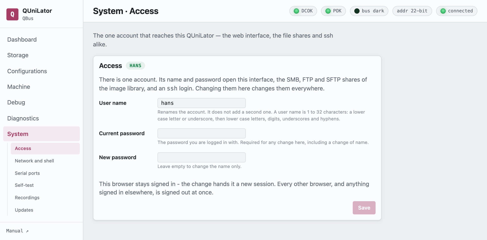

Who reaches this QUniLator, what it runs, and updating it. Each of those is a
page of its own, listed under **System** in the sidebar: Access, Network and
shell, Serial ports, Recordings, Updates.



## Access

There is one account. Its name and password open the web interface, the SMB, FTP
and SFTP shares of the image library, and an `ssh` login — change them here and
they change everywhere. The next request asks for the new ones, so the browser
will prompt again.

Changing the **user name** renames that account rather than adding a second one:
the file shares and the ssh login follow it. A name is 1 to 32 characters: a
lower-case letter or underscore, then lower-case letters, digits, underscores
and hyphens.

**Current password** is the one you are logged in with, and any change here
takes it — a change of name as much as of password.

> [!NOTE]
> **A name that is already an account**
>
> A name belonging to a Linux account this service did not create is refused,
> because taking one over is not a decision to make in a browser. Adopt it at
> the machine instead, with the service stopped:
>
> ```
> sudo systemctl stop qbone.service
> sudo qbone --setup-operator <name> --adopt-account
> sudo systemctl start qbone.service
> ```
>
> The account keeps its home, its files and its shell.

## Network and shell

**Host name** is the name this QUniLator has on the network. Renaming it moves
`qbone.local`, the DNS-SD advertisement, the DHCP lease and the login banner
together. Letters, digits and inner hyphens, up to 63 characters.

**SSH key** installs a public key for the account, which is how you reach a shell
and `sudo` there. Installing one replaces the key already present.

## Serial ports

Which of the BeagleBone's three UARTs carry a Linux login.

| | |
|---|---|
| `ttyS0` | the debug header, J1 pins 4/5 — needs a 3.3 V TTL adapter. Also the **kernel console**. |
| `ttyS1` | the cape connector. |
| `ttyS2` | the cape connector — and normally **held by the external console bridge**. |

**One port always keeps its login**: it is the way back onto a card whose network
has gone, so switching the last one off is refused. The USB port carries a login
of its own as well. A port the emulator is holding cannot take one either — free
it by turning the device or the
[console bridge](machine.md#external-console) off first.

> [!NOTE]
> **The kernel console moves with the login**
>
> Turning a login off moves where the kernel prints, and that takes a reboot to
> settle. Until then the old port keeps printing; the page says so when a reboot
> is owed.

## Console recordings

Sessions captured with **Record** on the [dashboard](dashboard.md#console) — both
what the machine printed and what was typed at it, whoever typed it. Each can be
downloaded or deleted.

## Updates

What the installed package is, and what the repository offers.

**Check now** asks; **Show what changed** fetches the changelog before you
commit. Installing replaces the emulator and **restarts the service, so the
running machine stops** — the page says so before it starts.

An update returns QUniLator to its **DIP-selected configuration**, so a
configuration applied by hand needs re-applying afterwards.

**Dismiss** stops a version being announced in the sidebar badge; **Announce it
again** undoes that.

The **Updates** page carries two sections: the emulator package this QUniLator
is — `qbone` or `unibone` — and the Debian underneath it.

**Operating system** is everything else on the BeagleBone, the emulator excluded.
Packages **held back** are listed rather than forced — the kernel and the cape
support are pinned deliberately. Some upgrades want a reboot, and the page says
which.
