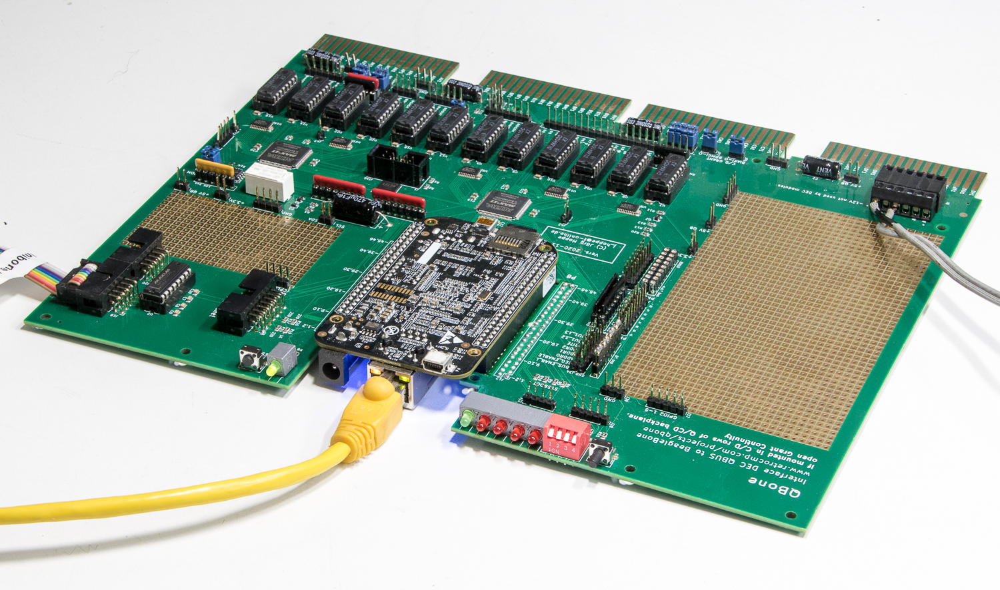
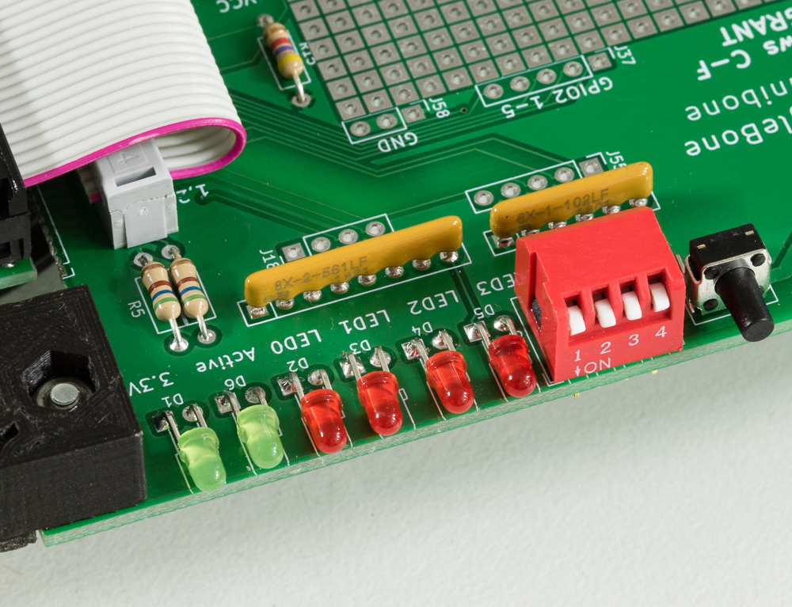
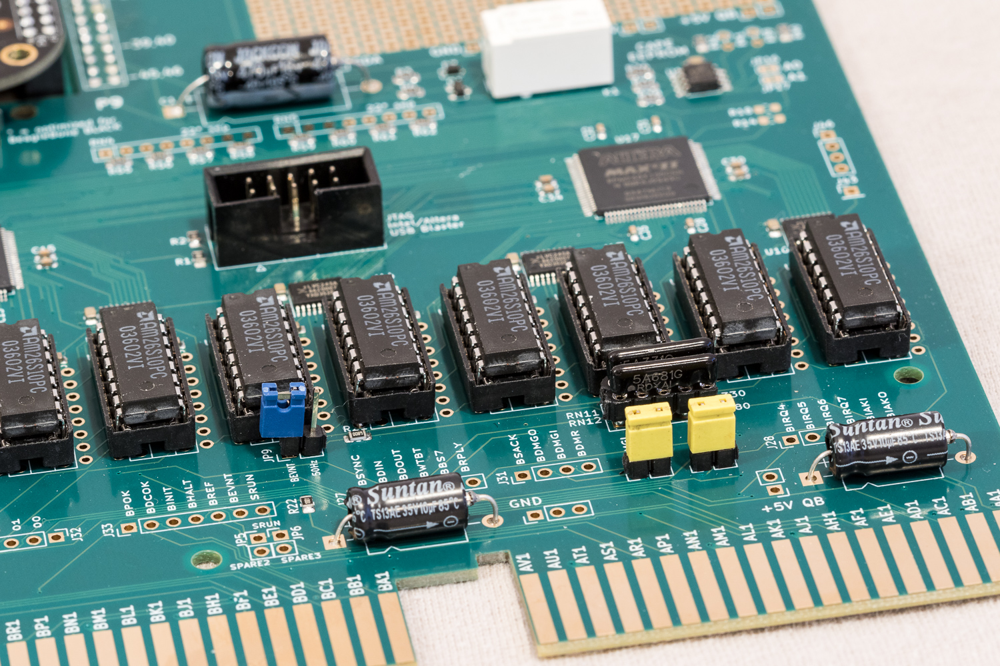

Whether you bought a card or built one, check it before it goes near a machine
you care about. The tests below go from cheapest to most revealing, and the last
one — the bus loopback — is the one that actually proves the card.

This is hardware-level work, so it runs from the interactive menu application
(`qbone-cli` or `unibone-cli`) rather than the web interface. Start it and it
takes the board from the running service for the length of the session — see
[Running the scripts you have](from-qunibone.md#running-the-scripts-you-have)
for what that costs and who is allowed to do it.

## What you need

Only **+5 V**. Connect it to the pins of the power capacitors or the `+5V UB`
pin header — *not* the BeagleBone's own 5 V jack, which leaves part of the
circuit unpowered because the relay never closes.

For the bus tests the card must sit in an **empty, terminated backplane**. One
terminator is enough and it must be **passive: resistors only, no boot ROM**.

> **UNIBUS · UniBone**
>
> An expansion backplane DD11-DK or -CK is best. Do not use an M9302: it drives
> SACK active-low, and if any `BG*IN` or `NPGIN` is unconnected or high you get a
> loopback error on latch 1.
>
> No G727 continuity cards are needed, and the NPG chain may be open or closed.

> **QBUS · QBone**
>
> Any quad QBUS backplane works. Some have terminators fitted already; otherwise
> add a QProbe or an M9400 REV11 with resistors only.
>
> No G9047 grant continuity cards are needed.



> [!WARNING]
> **The BeagleBone must be on the card to boot**
>
> Even to play with the BeagleBone alone, it has to be plugged into the card —
> the cape overlay disables the eMMC, and off the card the BeagleBone boots whatever
> Debian is on the internal eMMC instead of your SD image.

## 1. Power

Apply +5 V. The power relay must switch after about a second's delay; the BeagleBone
then produces 3.3 V and the green LED comes on. That one-second delay exists to
give the BeagleBone's reset circuit a clean power-on ramp regardless of how oddly a
vintage DEC supply comes up.

## 2. Boot and network

The blue LEDs flicker while Debian boots. After 30–90 seconds QUniLator should
answer on the network — see
[Find it on the network](install.md#find-it-on-the-network).

If it boots but never answers:

- Is the BeagleBone actually plugged into the card? (See the warning above.)
- Are the yellow and green Ethernet LEDs active?
- Try repowering. There is a long-standing bug in the BeagleBone's Ethernet interface
  that occasionally prevents it coming up.
- Fall back to the serial console.

## 3. Serial ports

The card exposes two RS-232 ports. UART1 is a Linux login; UART2 is available to
the emulation — it is where the emulated DL11 serial card lands.

> [!WARNING]
> **The pinout is not the PC-motherboard one**
>
> Crimping a cable from a PC-mainboard adapter's pinout will not work. Only GND,
> TXD and RXD are connected. Use a null-modem cable to your PC and a terminal at
> 9600 8N1, no hardware handshaking.

## 4. LEDs, switches and I²C

The user LEDs and switches are ordinary GPIOs, not PRU-driven. In the menu
application choose **TG** (GPIO) then **LB** (manual loopback): the four switches
should drive the four LEDs. Pressing the button enables the DS8641 driver array,
which lights the second green LED.



The card also carries a small I²C EEPROM holding the cape name, which is what
tells the kernel which pin configuration to load. Reading it exercises the same
I²C bus the add-on panels use:

```sh
hexdump -C /sys/bus/i2c/devices/i2c-2/2-0054/eeprom
```

## 5. The bus loopback test

This is the real test. Signals go out through the latch array and the DS8641
drivers onto the bus lines, and come back in through the drivers and input
latches to the PRU pins. It exercises the card, the terminators, and a good part
of the backplane.

**Preparation:**

1. Card in an empty, terminated backplane.
2. Fit the loopback jumpers on the grant lines.

> **UNIBUS · UniBone**
>
> Five jumpers, on the `BGIN`/`BGOUT` and `NPGIN`/`NPGOUT` lines.

> **QBUS · QBone**
>
> Two jumpers, on `IAKI`–`IAKO` and `DMGI`–`DMGO`. Also make sure the 50 Hz LTC
> source is **disabled**.



**Run it:** menu **TL** (test bus latches), then `>>> * r` to test every bus
signal endlessly with random patterns. Let it run as long as you can bear, and
stop it with `^C`.

**Reading a failure.** The test prints the signal path for each failed bit.

> **UNIBUS · UniBone**
>
> The likeliest cause is a solder failure on the SMD input/output latches. Check
> the physical voltage on the bus line first: if the level is as expected the
> output branch is fine and the fault is in the 74LVTH541 input path; if not it is
> the 74LS377 output path. Remember that on UNIBUS a logical 1 is 0 V and a logical
> 0 is about 3.4 V — except for the BG and NPG signals.

> **QBUS · QBone**
>
> The likeliest causes are backplane setup errors and — genuinely — mis-inserted
> DS8641 drivers. After that, open solder joints or shorts between pins.

Two things worth doing while it runs:

- **Test the test.** Pull one loopback jumper; the run should stop with an error.
- **Bend and knock the card** gently. That is what exposes a bad joint.

> [!TIP]
> **It doubles as a backplane test**
>
> The bus lines are pulled up by the terminators, so with a single terminator at
> one end you can move the card from slot to slot and find any signal that has no
> connection to it. It will even test bus cables between separate backplanes.

**Remove the loopback jumpers when you are done.**

## 6. A real device

> **UNIBUS · UniBone**
>
> If the loopback passes, go one step more realistic: add a UNIBUS memory card and
> have UniBone exercise it. That tests DMA cycle implementation and timing, not
> just static connections. Work in *arbitration inactive* mode, since no processor
> is running. Note that a memory card wants more current, and probably more than
> just +5 V.

## Then run it in a machine

If all of that passed, fit the card to a real machine and boot something — the
[configuration catalogue](https://qunilator.com/configurations/) is the quickest
route to a running system.
