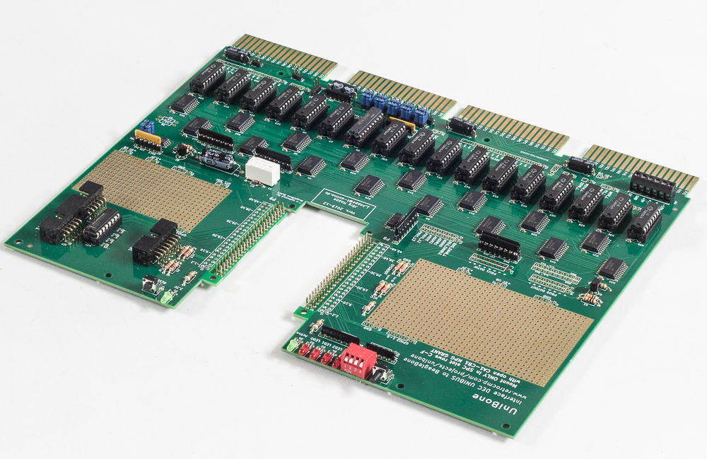
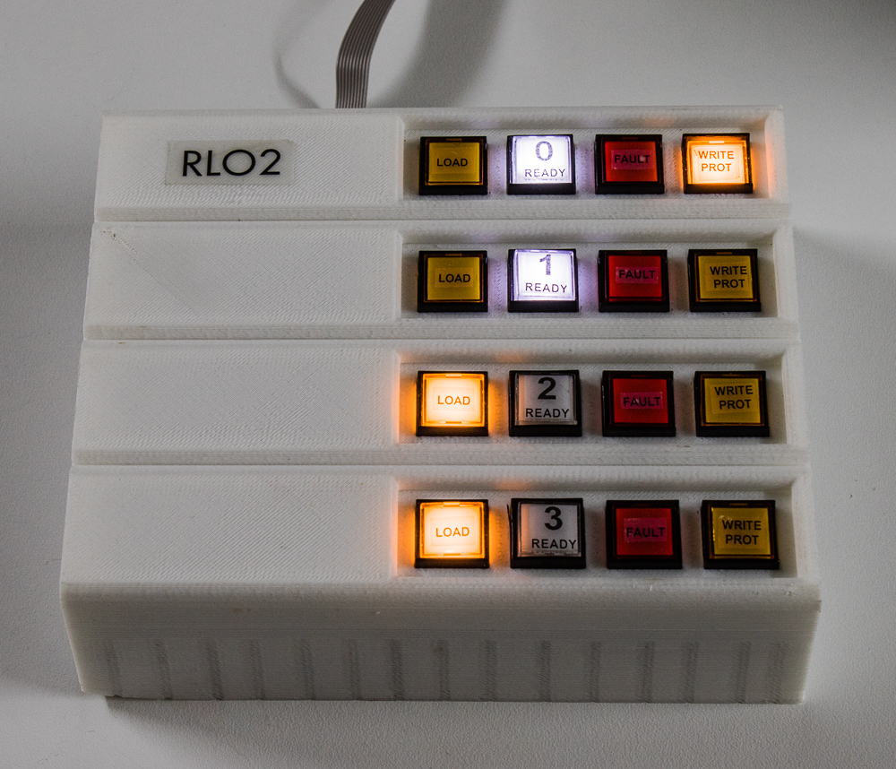

The hardware and the software are both open source, under the BSD licence: you
may forward, modify and sell any of it, as long as the copyright notice stays
visible. There is no warranty.

That leaves three ways to get a card.

## Built and tested

Jörg Hoppe builds cards to order. Prices are indicative and move with component
costs — ask when you enquire.

| | UniBone | QBone |
|---|---|---|
| Built and tested | €300 | €300 |
| Kit, SMD parts already mounted | €180 | €180 |

The BeagleBone Black is **not** included in either — reckon on about €70, and it
moves day to day. Shipping runs about €16 within the EU and around €60
internationally; shipping to the US is intermittently impossible depending on
tariffs.

Contact Jörg through [retrocmp.com](https://retrocmp.com/) to order.

## Build your own

Blank PCBs are not sold, but the Gerbers are yours to send to a fabricator. The
whole KiCad project — schematic, PCB, the two CPLD projects and the 3D-printable
BeagleBone mount — is published:

- **PCB design files** — [files.retrocmp.com/qunibone-misc/01.01_pcb/](http://files.retrocmp.com/qunibone-misc/01.01_pcb/)
- **Source** — [github.com/QUniBone/QUniLator](https://github.com/QUniBone/QUniLator)

The design is deliberately low-tech: through-hole wherever it can be, standard
TTL, no FPGA, and nothing fine-pitch. It can be assembled by hand. The spacers
for the BeagleBone mount are under `bbbadapter` in the PCB archive.

Cards sold as kits arrive with the CPLDs already programmed. If you fabricate
your own you will need Lattice Diamond and a programming adapter to load them.

## What else you need

- **A BeagleBone Black.** Not a Pi — see
  [Why a BeagleBone](what-it-is.md#why-a-beaglebone).
- **A microSD card, 8 GB or larger.** The release takes a couple of gigabytes
  and the rest is where your disk and tape images live, which is what the 8 GB
  is for. A 4 GB SD card boots and runs, with little room left for images. Buy a
  good one: unlike in a camera, Debian is on it the whole time, and speed and
  reliability both matter.
- **A 90° angled Ethernet plug**, if the card is going into a closed DEC case.
- **Grant continuity cards** for the empty slots — G727 on UNIBUS, G9047 on QBUS.
- **A terminator**, if the card is going into an empty backplane for testing. It
  must be passive: resistors only, no boot ROM.

## The panel box

An optional lamps-and-switches box attaches over the I²C bus, giving an emulated
drive real controls. The PCB is a generic 16-lamp, 16-input GPIO expander rather
than anything RL02-specific, and several boxes daisy-chain.

A complete kit — 3D-printed case, PCB, parts, buttons, lamps, cables and
adhesive lamp labels — is €160; assembled and tested €220.

## Then what

Once the card arrives: [install the software](install.md), then run the
[acceptance test](acceptance-test.md) before trusting it in a machine you
care about.
