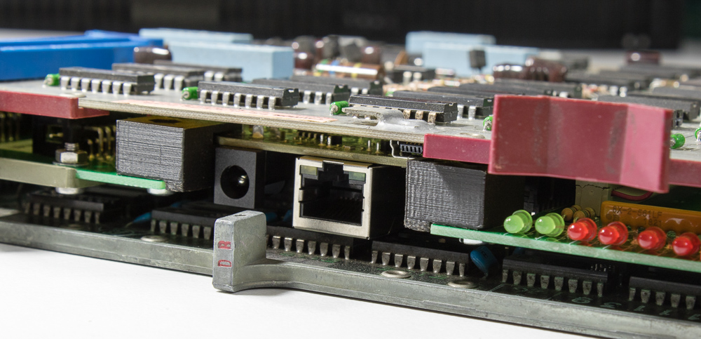
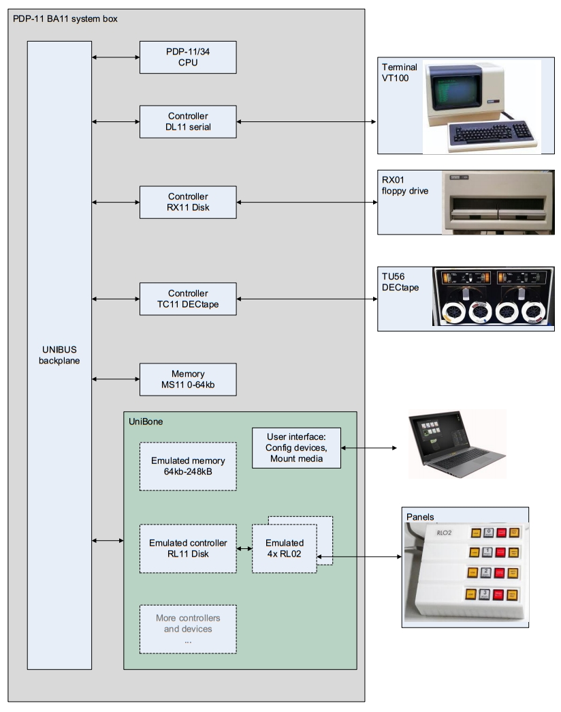
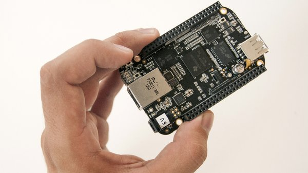

**QUniLator** is a bridge between a DEC bus and a modern Linux environment. Its
primary application is device emulation: it presents controllers, drives, memory
and terminal lines to a real machine, over the real backplane, as cards that
answer like the originals.

It runs on a **BeagleBone Black** carried by one of two cards.

> **UNIBUS · UniBone**
>
> **UniBone** drives UNIBUS. It needs a standard quad SPC ("small peripheral
> connector") slot, and interfaces to many PDP-11s as well as to PDP-10 and VAX
> expansion backplanes.

> **QBUS · QBone**
>
> **QBone** drives QBUS. It is a quad Flip-Chip card and takes QBUS on the A/B
> fingers, so it plugs into any QBUS card cage from an LSI-11/03 to a MicroVAX.

Everything above the bus wires is shared: the same BeagleBone, the same software,
the same web interface, the same SimH-compatible media files. Which is why there
is one manual rather than two — see [Choose your card](choose-your-card.md)
if you are deciding which you need.

## Not just another device emulator

Several device-emulator projects exist. QUniLator differs in a few deliberate ways:

- It emulates **device and controller together at the bus level**, rather than a
  drive hanging off a genuine DEC controller card. Nothing between the machine and
  the emulation but the backplane.
- It is **configurable**: arbitrary devices in parallel, up to a whole system.
- A **full Linux sits behind it**, so the board can run SimH, complex diagnostic
  software, or a network service alongside the emulation.
- Emulated devices can drive **real hardware** — the BeagleBone is full of
  interfaces, and the card carries patch fields and a powered I²C bus for
  lamps-and-switches panels.
- All programming is **plain C/C++**. No FPGA.
- The hardware is simple enough to be a do-it-yourself kit: through-hole where it
  can be, hand-solderable, no fine-pitch parts.

The economics matter too. Bus controller cards that interface to any modern
standard are rare and expensive — a UNIBUS SCSI or Ethernet card runs to four
figures when one can be found at all.

## What it emulates today

Grouped by what the machine sees. This is a summary; the per-device reference,
generated from the source, is [still to come](../project/roadmap.md).

| | |
|---|---|
| **Disk** | RL11 with RL01/RL02 · RK11 with RK05 · MSCP (UDA50 and friends) · RS11/RF11 DECdisk · RX11 and RX211 with RX01/RX02 floppies |
| **Tape** | TM11/TS11 · TMSCP |
| **Memory** | a card's worth of the BeagleBone's DDR, at an address range you name |
| **Serial** | DL11-W · DZV11 · DHV11 |
| **Network** | DELQA · DEUNA, bridged to the host LAN |
| **Bootstrap** | M9312 · MRV11-D · MXV11-B2 |
| **Clocks** | KW11-L line clock · KW11-P programmable clock |
| **Graphics** | VCB01 / QVSS framebuffer |
| **Other** | KE11 EAE · a "demo" device exposing the board's own LEDs and switches · lamps-and-switches panels over I²C |

> **UNIBUS · UniBone**
>
> UniBone can also emulate **the processor**: a KA11 (11/20) and a KD11-EA (11/34
> with KT11-D memory management), validated against the original DEC MAINDEC
> diagnostics. That makes a backplane with no working CPU into a running machine.

> **QBUS · QBone**
>
> QBone ships no emulated processor — a QBone drives a real CPU board in the cage
> beside it. Everything else in the table above applies.

## Why a BeagleBone

The usual first question is "why not a Raspberry Pi?". What this job needs is not
CPU power or graphics but **fast, jitter-free GPIOs**, and that is the BeagleBone's
particular strength.

The Sitara AM335x carries two **PRUs** — Programmable Realtime Units — 200 MHz
32-bit RISC cores with their own GPIOs, built for bit-banged protocols. They have
no pipeline and no cache, so an opcode always takes 5 ns. A square-wave loop on a
PRU pin runs at 66 MHz.

Speed matters less than **determinism**. A Linux user process gets descheduled;
signals it produces jitter, and inputs it samples lose edges. The PRUs run
independently of Linux timing, so the bus protocol holds its timing regardless of
what the ARM side is doing. The ARM runs Debian with the RT patch and talks to the
PRUs through shared memory.

Against an "ARM + FPGA" design, the BeagleBone wins on the things this project
cares about: it is a complete Linux platform with a community behind it, small
enough for a Flip-Chip slot, needs no 100-pin fine-pitch parts on the PCB, and
compiles its own software in minutes rather than synthesising a bitstream.

## The names

| | |
|---|---|
| **QUniLator** | the software, and this site |
| **UniBone** | the UNIBUS card |
| **QBone** | the QBUS card |
| **QUniBone** | the GitHub organisation, and the older combined name for the two cards |

The project is BSD-licensed — hardware and software both. See
[Credits and licence](../project/credits.md).
