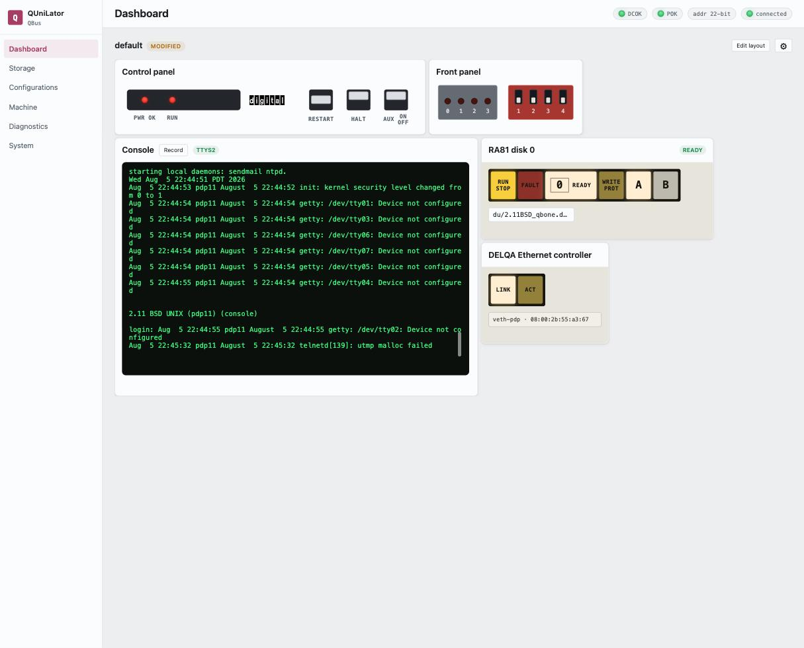

> [!NOTE]
> **Verified on real hardware**
>
> QUniLator **1.16.0-1**, 2026-08-06, on a **real KDJ11-D (PDP-11/53)** in a
> QBUS backplane. The processor is real; QUniLator supplies the disk and the
> Ethernet.

## What you will have at the end

A PDP-11 running 2.11BSD multi-user, with a UNIX filesystem on a disk that is a
file and an Ethernet address on your own network — reachable by `telnet` from
your desk.



If [XXDP](xxdp-rl02.md) proved the machine works, this is the one that makes it
useful.

## The machine

| | |
|---|---|
| **Processor** | Real KDJ11-D (PDP-11/53) — 1.5 MB of its own memory, its own boot ROM and console line |
| **Backplane** | QBUS, QBone in a quad slot |
| **From QUniLator** | A UDA50 MSCP controller with one RA81, and a DELQA Ethernet controller |

Three devices. The processor supplies everything else.

## What you need

- A 2.11BSD **MSCP disk image**. The one here is `du/2.11BSD_qbone.dsk`, a
  1 GB volume carrying a kernel built for this machine.
- A free address on your LAN, and its gateway. This walkthrough uses
  **192.168.2.180** with gateway **192.168.2.1** — substitute your own.
- The console line cabled and its speed set, per
  [the XXDP walkthrough](xxdp-rl02.md#1-point-the-console-at-the-right-line).

## 1. Build the machine

On **Configurations**, start from `default` (everything off) and add three
devices:

| Device | Setting |
|---|---|
| `uda` | the UDA50 controller, defaults are right |
| `uda0` | an RA81 holding `du/2.11BSD_qbone.dsk` |
| `delqa` | the Ethernet controller, on interface `veth-pdp` |

Leave `DL11` disabled — the processor has its own console.

> [!IMPORTANT]
> **Set the image before you enable the drive**
>
> Enabling the controller rebuilds the drives under it, which clears an image
> assigned beforehand. Assign the image, then enable — and check the drive
> reports **READY** with a non-zero capacity before going on.

The disk announces itself by the **image's** size rather than the drive type's,
which is what lets a 1 GB volume live on a drive DEC built at 456 MB. You will
see it in the boot log.

## 2. Switch it on and boot

Press **AUX ON/OFF**. The processor's ROM counts down and finds the MSCP disk:

```
9 8 7 6 5 4 3 2 1

DU0
53Boot from ra(0,0,0) at 0172150
:
```

The `:` is 2.11BSD's boot block asking which kernel to load. Answer:

```
ra(0,0,0)unix
```

> [!CAUTION]
> **Type it one character at a time**
>
> The serial line has no receive buffer worth the name. Pasting `ra(0,0,0)unix`
> as a burst arrives as `r,)x` and the boot fails. The browser console types at
> human speed and is fine; a script must pace each character on its echo.

The kernel comes up and tells you what it found:

```
UNIX #1: Sep 10 12:20:06 PDT 2019
    root@Tue:/usr/src/sys/QBONE

ra0: Ver 3 mod 6
ra0: RA81  size=1953301
attaching qe0 csr 174440
qe0: DEC DELQA addr 08:00:2b:55:a3:67
attaching lo0

phys mem  = 1572864
avail mem = 1174912
```

Three lines worth reading. `size=1953301` is the image's block count, not an
RA81's. `qe0` is the DELQA, and its address is derived from the BeagleBone's own
MAC, so it is unique without you choosing one. `phys mem = 1572864` is the
processor's own 1.5 MB — QUniLator supplied none of it.

You land in a single-user shell at `#`.

## 3. Point it at your network

2.11BSD reads its network settings from `/etc/netstart` and resolves its own
name through `/etc/hosts`. A stock image is set up for whatever LAN it was built
on, so both need repointing — after which every reboot comes up on the network by
itself.

```sh
sed -e 's/^broadcast=.*/broadcast=192.168.2.255/' \
    -e 's/^default=.*/default=192.168.2.1/' /etc/netstart > /tmp/ns
cp /tmp/ns /etc/netstart

sed 's/^10\.0\.1\.212/192.168.2.180/' /etc/hosts > /tmp/h
cp /tmp/h /etc/hosts
```

The second one matters and is easy to miss: `netstart` passes the **hostname** to
`ifconfig`, so the address the machine gets is whatever `/etc/hosts` maps that
name to.

`netmask` is already `255.255.255.0`. Leave `routedflags=NO` alone — the file
says why, in capitals.

## 4. Go multi-user

Press **Ctrl-D**. `netstart` runs, and the daemons come up:

```
Assuming NETWORKING system ...
add net default: gateway 192.168.2.1
starting system logger
starting network daemons: inetd rwhod printer.
starting local daemons: sendmail ntpd.

2.11 BSD UNIX (pdp11) (console)

login:
```

## 5. Reach it from your desk

```console
$ ping -c3 192.168.2.180
3 packets transmitted, 3 packets received, 0.0% packet loss

$ telnet 192.168.2.180

2.11 BSD UNIX (pdp11)

login:
```

That login prompt came off a PDP-11, over an Ethernet controller that is
software, out of a disk that is a file.

## What can go wrong

| | |
|---|---|
| **The boot block says `:` and nothing you type works** | Characters are being dropped. Type slower, one at a time. |
| **The drive shows capacity 0** | The image was assigned before the controller was enabled and got cleared. Assign it again. |
| **Hard errors, then a corrupted filesystem** | The volume is bigger than the drive type and is being truncated. Check the boot log says `size=` the image's block count. |
| **Multi-user hangs with the console dead** | A serial mux fighting for interrupt time. Disable `dzv11` if you have it enabled; this machine does not. |
| **`ping` is not found in single-user** | `/usr` is not mounted yet. Go multi-user first. |
| **Nothing on the LAN** | Check the DELQA's `interface` parameter names the bridged interface (`veth-pdp` here). The host's own address is not reachable from a raw socket on the same NIC — the bridge exists for that. |

## Next

**Save As…** the configuration — this one is saved as `211bsd` — and bind it to
a **Power-on DIP** setting so the machine boots into UNIX whenever it is
switched on.

Then try the other direction entirely: [VMS on an emulated
VAX](vax-vms.md), where QUniLator supplies the processor too.
