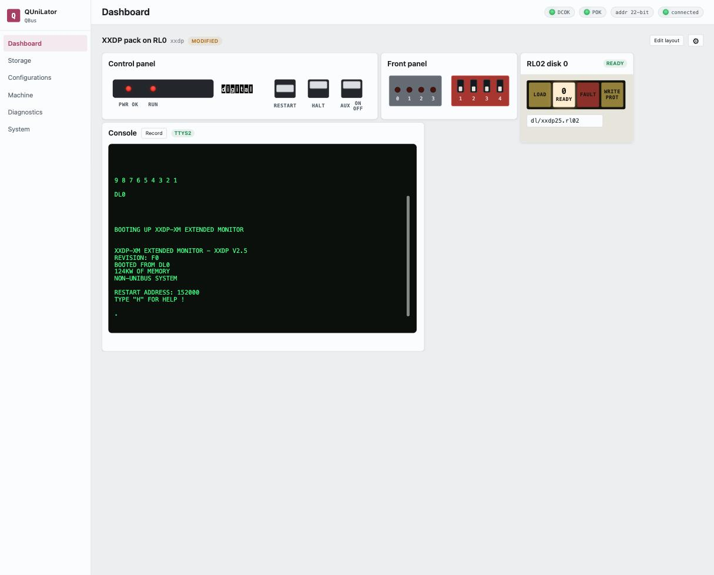

> [!NOTE]
> **Verified on real hardware**
>
> QUniLator **1.16.0-1**, 2026-08-06, on a **real KDJ11-D (PDP-11/53)** in a
> QBUS backplane. The processor is real; QUniLator supplies the disk.

## What you will have at the end

DEC's XXDP diagnostic monitor, booted by your machine's own ROM, off an RL02
pack that is a file on the BeagleBone — and a prompt you can run the factory
field diagnostics from.



This is the shortest path from *the card passes its acceptance test* to *my
machine runs something*, and it is worth doing before anything more ambitious:
XXDP is small, it is the monitor DEC's own diagnostics run under, and if it
boots then the card, the bus and the processor are all talking to each other.

## The machine

| | |
|---|---|
| **Processor** | Real KDJ11-D (PDP-11/53), with its own memory, boot ROM and console line |
| **Backplane** | QBUS, with the QBone card in a quad slot |
| **From QUniLator** | The RL11 controller and the RL02 drive — nothing else |

The processor matters more than the model number. This one carries **its own
memory and its own boot ROM**, so QUniLator supplies only the disk subsystem. A
processor with neither — a bare KDJ11-A, for instance — needs QUniLator to
supply memory and a bootstrap ROM as well, and the
[note at the end](#if-your-processor-has-no-memory-or-no-rom) says what to add.

## What you need

- A QUniLator that passes the [acceptance test](../start/acceptance-test.md),
  fitted to the machine.
- The **XXDP 2.5 RL02 pack**. It ships on the card image as
  `dl/xxdp25.rl02` — check **Storage** before going looking for one.
- Your machine's **console line cabled to the card**, if the processor has a
  serial line of its own. On a KDJ11-D that is the console connector on the CPU
  board, running to the QBone's UART2 with a null-modem cable.

## 1. Point the console at the right line

Open **Machine**. Under *External console*, set **Source** to `BBB /dev/ttyS2`
and **Baud** to whatever the processor's own console line is jumpered for — 38400
on the machine here.

This is the step people lose time on, so it is worth a moment. If the processor
has a console of its own, that line is the console and QUniLator only reads it.
If the processor has none, set Source to **Off** and let QUniLator's emulated
DL11 be the console instead.

> [!TIP]
> **Garbage means the baud is wrong; silence means the cable is**
>
> A mismatched speed still gives you characters — `ôôôôWWô` and the like. A line
> that produces nothing at all in any CPU state is not connected.

## 2. Build the machine

Open **Configurations** and either pick the bundled **XXDP pack on RL0** or make
it yourself — it is two devices:

| Device | |
|---|---|
| `rl` | the RLV12 controller, at its default 174400 |
| `rl0` | an RL02 drive holding `dl/xxdp25.rl02`, with **power** on and **RUN/STOP** pressed in |

The two drive switches are the ones on the front of a real RL02: power it up,
then press RUN/STOP to spin it up. A drive left in LOAD never becomes ready and
the ROM will not find it.

Leave `DL11` **disabled**. The processor already has a console at 777560, and a
second one at the same address means two cards answering one address.

## 3. Switch the machine on

On the **Dashboard**, press **AUX ON/OFF**.

The processor's ROM runs its self-test, counts down, and boots the first device
it finds:

```
9 8 7 6 5 4 3 2 1

DL0

BOOTING UP XXDP-XM EXTENDED MONITOR

XXDP-XM EXTENDED MONITOR - XXDP V2.5
REVISION: F0
BOOTED FROM DL0
124KW OF MEMORY
NON-UNIBUS SYSTEM

RESTART ADDRESS: 152000
TYPE "H" FOR HELP !

.
```

`BOOTED FROM DL0` is the emulated drive. `NON-UNIBUS SYSTEM` is XXDP telling you
it found a QBUS.

## 4. Run a diagnostic

At the `.` prompt, load the RL subsystem test:

```
.R ZRLGE0
```

XXDP answers with the diagnostic's banner and a `DR>` prompt. `STA` starts it,
and it asks what hardware it is testing:

```
DR>STA

CHANGE HW (L)  ? Y
# UNITS (D)  ? 1

UNIT 0
RL11=1, RLV11=2, RLV12=3 (O)  ? 3
BUS ADDRESS (O)  174400 ?
VECTOR (O)  160 ?
DRIVE (O)  0 ?
DRIVE TYPE = RL01 (L) Y ? N
BR LEVEL (O)  5 ?

CHANGE SW (L)  ? N
```

Answer **3** for the RLV12 — that is the controller QUniLator emulates — and
**N** to *DRIVE TYPE = RL01*, because the pack is an RL02. Everything else takes
its default.

> [!CAUTION]
> **It will offer to destroy your pack**
>
> Partway through it asks:
>
> ```
> NXT TST MAY ZERO LD UNIT. DOIT ANYWAY?
> ```
>
> Answer **N**. The drive it means is the one you booted from, and those tests
> write over it. To run them properly, put a **scratch pack on a second drive**
> and point the dialog's *DRIVE* answer at that one instead.

## What can go wrong

| | |
|---|---|
| **Nothing on the console** | The line is not connected. Garbage means the baud is wrong; silence means the cable is. |
| **The ROM does not offer DL0** | The drive is not ready. Check *power* and *RUN/STOP* on the drive widget — the dashboard shows *READY* when it is. |
| **`?` and an `@` prompt** | The processor is in micro-ODT, which means it halted rather than booted. **RESTART** on the control panel runs it again from the power-up vector. |
| **The prompts loop forever** | A DRS prompt marked `(L)` has no default, so an empty answer is not an answer. Type `Y` or `N`. |

## If your processor has no memory or no ROM

Some processors bring less to the party, and QUniLator makes up the difference.
Ask the machine rather than guessing: **Machine → memory probe** sizes what is
really out there.

| The processor lacks | Add |
|---|---|
| memory | the **MEM** device, sized to fill the space the probe found empty |
| a bootstrap ROM | **MRV11-D** on QBUS, **M9312** on UNIBUS |
| a console line | **DL11**, with *External console* set to **Off** so it can have the port |

## Next

Save what you built — **Save As…** on the Configurations screen — and bind it to
a **Power-on DIP** setting so the machine comes back by itself. Then take on a
real operating system: [2.11BSD on an MSCP disk](211bsd-network.md).
